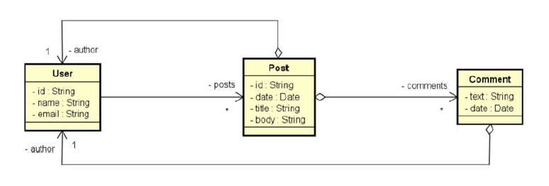
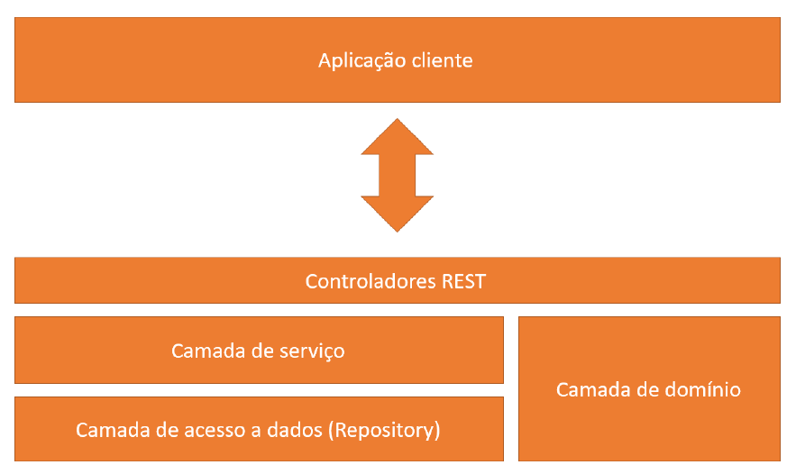

# workshop-spring-boot-mongodb

Neste projeto Java, foi explorado o uso do MongoDB com o Spring Boot. O MongoDB é um banco de dados orientado a documentos, enquanto o Spring Boot é um framework Java popular.

Objetivo Geral:

Compreender as diferenças entre o paradigma orientado a documentos e relacional.
Implementar operações CRUD (Create, Read, Update e Delete).
Refletir sobre decisões de design para um banco de dados orientado a documentos.
Implementar associações entre objetos usando objetos aninhados e referências.
Realizar consultas com Spring Data e MongoRepository.
Estrutura do Projeto:

- Pacote "domain" contendo as classes Java representando os documentos.
- Pacote "dto" com os objetos de transferência de dados utilizados na aplicação.
- Pacote "repository" para as interfaces de operações de acesso aos dados.
- Pacote "resources" responsável pelos controladores para lidar com as requisições HTTP e interagir com os serviços.
- Pacote "services" contendo a lógica de negócio e as operações CRUD.

O projeto proporcionou uma compreensão mais aprofundada em bancos de dados NoSQL, especialmente o MongoDB, e aprendi a integrá-lo ao ecossistema do Spring Boot. Utilizando o Spring Data e MongoRepository, pode-se assim simplificar a camada de persistência, permitindo uma maior concentração na lógica do negócio.

Essa experiência tem sido valiosa para adquirir habilidades em desenvolvimento Java com banco de dados NoSQL e o ecossistema Spring Boot, possibilitando a construção de aplicações eficientes e escaláveis. Agora, posso aplicar esse conhecimento em projetos futuros, continuando a aprimorar minhas habilidades como desenvolvedor.

Este projeto faz parte do curso de Java do Professor Nélio Alves, disponível na Udemy. 

